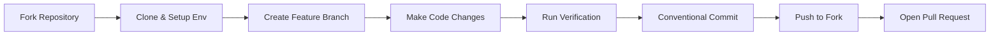

# Contributing to VeoLMS

Welcome to the VeoLMS contributor documentation! We are excited to have you contribute. Whether you are fixing a bug, improving documentation, or proposing new features, these guidelines will help you get started smoothly.

---

## 📚 Contribution Documentation Index

Explore the dedicated contribution guides:

| Document                                                 | Description                                                                              |
| :------------------------------------------------------- | :--------------------------------------------------------------------------------------- |
| 🚀 [**Getting Started**](./getting-started.md)           | Forking the repository, cloning, remote setup, local environment, and branching          |
| 📝 [**Git Commit Guidelines**](./commit-guidelines.md)   | Conventional Commits rules, formatting, pre-commit linting & verification checks         |
| 🔀 [**Pull Requests**](./pull-requests.md)               | Opening PRs, PR description templates, review lifecycle, and updates                     |
| ✍️ [**Spelling & Minor Edits**](./spelling-and-typos.md) | Guidelines on handling typos, spelling corrections, and preventing spam PRs              |
| 🔒 [**Security Policy**](./security.md)                  | Responsible disclosure of security vulnerabilities via email (DO NOT open public issues) |
| 🤝 [**Code of Conduct**](../../CODE_OF_CONDUCT.md)       | Community participation rules, inclusion standards, and enforcement                     |

---

## ⚡ Quick Contribution Workflow



### 1. Fork & Setup

- Fork `veolms/veolms` to your personal GitHub account.
- Clone your fork locally and configure the `upstream` remote.
- Keep your fork's `development` branch synced with `upstream/development`.
- Run `pnpm install`, configure `.env`, and start PostgreSQL with `pnpm compose:up`.
- Run `pnpm db:migrate` and `pnpm db:seed`.

### 2. Develop on a Topic Branch

> [!IMPORTANT]
> **Branch Rule**: Never push to or branch from `main`. Always create your topic branch from `upstream/development`:
```bash
git checkout development
git fetch upstream
git rebase upstream/development
git checkout -b feat/your-feature-name
```
- Keep changes scoped to a single task or improvement.

### 3. Mandatory Pre-Commit Checks

Before committing any changes, run:

```bash
pnpm format       # Format code with Prettier
pnpm lint         # Lint code with ESLint
pnpm typecheck    # Check TypeScript types
pnpm verify       # Run complete build and validation suite
```

### 4. Conventional Commits

Write structured commit messages using Conventional Commits:

```text
feat(api): add course search endpoint
fix(database): correct migration column constraint
docs(contributing): clarify fork setup instructions
```

### 5. Open a Pull Request

- Push your branch to your personal fork (`origin`).
- Open a Pull Request against `veolms/veolms:development` (do NOT target `main`).
- Provide a clear summary, testing steps, and link any related issues.

### 6. Security Vulnerabilities

> [!IMPORTANT]
> **Do not open public issues for security vulnerabilities.** Email `security@veolms.org` with reproduction details. See [Security Policy](./security.md) for details.

---

## 🛠️ Essential Development Commands

| Command             | Purpose                                                             |
| :------------------ | :------------------------------------------------------------------ |
| `pnpm dev`          | Start both API and Web in development mode                          |
| `pnpm dev:api`      | Start Fastify API server only (`http://localhost:4000`)             |
| `pnpm dev:web`      | Start React Router web development server (`http://localhost:3000`) |
| `pnpm compose:up`   | Start PostgreSQL 18 container                                       |
| `pnpm compose:down` | Stop PostgreSQL container                                           |
| `pnpm db:migrate`   | Run database migrations                                             |
| `pnpm db:seed`      | Run database seed script                                            |
| `pnpm format`       | Auto-format files with Prettier                                     |
| `pnpm format:check` | Check if files adhere to Prettier formatting                        |
| `pnpm lint`         | Run ESLint checks                                                   |
| `pnpm typecheck`    | Run TypeScript type checking across packages                        |
| `pnpm verify`       | Run full check suite (`format:check`, `lint`, `typecheck`, `build`) |
